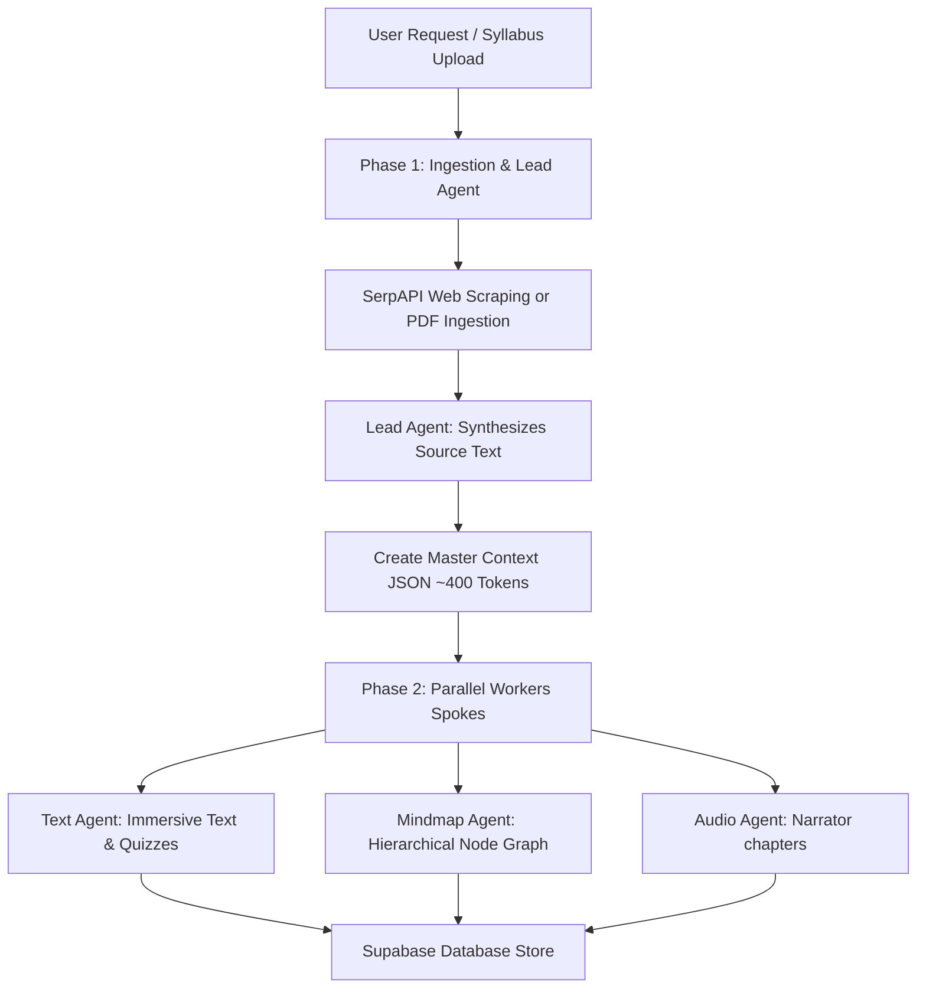
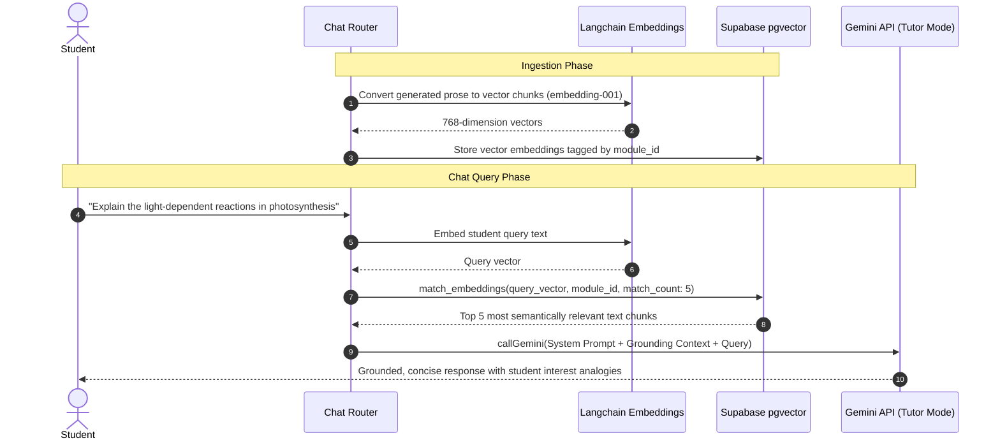

# AMI — Autonomous Learning Orchestrator

AMI (Autonomous Multimodal Instructor) is an agentic AI-powered educational system that turns any topic query or uploaded syllabus PDF/images into a hyper-personalized study module. It features interactive learning companions, study materials, and step-marking mock exams.

Developed for **GCEM Hacks 4.0**, this project utilizes a custom **Hub-and-Spoke Agentic Architecture**, **Langchain-based Retrieval-Augmented Generation (RAG)** via vector databases, and a resilient, self-healing multi-key rotation and model-fallback system.

---

## 🌟 Key Features
- **Instant Topic & Syllabus Ingestion**: Enter any query, Wikipedia link, or drag-and-drop syllabus PDFs/images (supports OCR).
- **Custom AI Mock Test & Step-Marking**: Compiles an exam matching your exact marks constraints and question weights, displaying detailed step-by-step model answers.
- **Adjustable Difficulty Dropdown**: Toggle difficulty between **Easy**, **Medium**, and **Hard** dynamically inside the exam.
- **RAG-based AI Tutor (AMI Chat)**: A conversational tutor anchored strictly to your uploaded material using vector embeddings, preventing off-topic deviations and hallucinations.
- **Structured Study Materials**: Instantly generates **Immersive Text** with inline concept checks, a hierarchal **Mindmap** diagram, and an **Audio Lesson** narrator script.

---

## 🛠️ Tech Stack
- **Frontend**: Vite · React 18 · Vanilla CSS variables & premium dark/glassmorphic theme elements.
- **Backend**: Node.js · Express · TypeScript.
- **AI Orchestration**: Google Gemini API SDK (`@google/generative-ai`) · Langchain (`@langchain/google-genai`).
- **Database & Storage**: Supabase (PostgreSQL with `pgvector` indexing).
- **File Processing**: `pdf-parse` (Syllabus scraping).

---

## 🤖 Custom Multi-Agent Architecture
AMI operates on a **Hub-and-Spoke Orchestration Model** separated into two distinct phases to achieve high speed and low API cost:



### 1. Lead Agent (The Hub)
Compresses raw, messy web scrapes or parsed PDF text (up to 8,000 tokens) into a compact, structured **Master Context** JSON schema (~400 tokens). It establishes:
- The Table of Contents (TOC) with exactly 4 sections.
- 5-8 core glossary concepts.
- 5-7 standalone key facts.
- Search keywords for image matching.

### 2. Spoke Agents (The Workers)
Downstream worker agents receive only the compact Master Context, reducing input token overhead by **94%**:
- **Text Agent**: Expands the Master Context into 4 prose sections using customized analogies matching student persona interests (e.g. sports, music) along with 4 inline multiple-choice quiz questions.
- **Mindmap Agent (Zero-AI)**: Instantly maps the core concepts and terms into a visual node connection map in Node.js without requiring model inference.
- **Audio Agent (Zero-AI)**: Compiles the prose sections into a formatted audio lesson narrator script dynamically.
- **Mock Test Agent**: Evaluates the syllabus parameters to generate exact question distribution grids, compiling comprehensive step-marking rubrics and model answer sheets.

---

## 🧠 Langchain & Vector RAG Modeling
To ensure the AI Chatbot companion (AMI AI) remains strictly grounded in the learning materials and behaves as an expert tutor, we built a **Retrieval-Augmented Generation (RAG)** pipeline:



### Ingestion & Chunking
1. The backend parses the newly generated prose content sections and slide narrations.
2. It breaks the prose down into distinct paragraph-level semantic blocks.
3. Using the Langchain `@langchain/google-genai` SDK, it calls Google's `embedding-001` model to generate **768-dimension vector embeddings** of the text.
4. The vectors are saved to a PostgreSQL database table equipped with the `pgvector` extension.

### Semantic Search & Grounding
1. When a student messages the chat companion, the router embeds the query with the same Langchain embedder.
2. It queries Supabase using a cosine similarity RPC database function (`match_embeddings`) to fetch the **top 5 most relevant document chunks** matching the current learning module:
   ```sql
   CREATE OR REPLACE FUNCTION match_embeddings (
     query_embedding vector(768),
     match_module_id uuid,
     match_count int
   ) RETURNS TABLE (
     id uuid,
     chunk_text text,
     similarity float
   ) AS $$
   BEGIN
     RETURN QUERY
     SELECT
       embeddings.id,
       embeddings.chunk_text,
       1 - (embeddings.embedding <=> query_embedding) AS similarity
     FROM embeddings
     WHERE embeddings.module_id = match_module_id
     ORDER BY embeddings.embedding <=> query_embedding LIMIT match_count;
   END;
   $$ LANGUAGE plpgsql;
   ```
3. The retrieved text is injected as context inside Gemini's `systemInstruction` parameters to keep the model grounded. The chatbot detects off-topic queries, issuing warnings if the student attempts to ask about subjects unrelated to the active module.

---

## ⚡ API Resilience & Key Rotation
When deploying with Gemini Free-tier API keys, applications easily run into rate limits (HTTP 429). We designed an industrial-grade **Key Rotation & Self-Healing Service** ([gemini.ts](file:///c:/gcem-hacks/ami/backend/src/services/gemini.ts)):

### 1. Multi-Account Rotation (No shared GCP project)
* Rotates requests across a pool of **27 API keys** created on separate Google accounts, bypassing Google Cloud's project-level limits.
* Employs a **2-second reuse delay** per key to protect against burst rate-limiting.

### 2. Model Fallback Chain
* Google limits free-tier IPs and keys. If a key returns a `429 Too Many Requests` on `gemini-2.0-flash`, our service **automatically attempts `gemini-2.5-flash` on the same key**, and cascades down to `gemini-3.5-flash` and `gemini-flash-latest` before moving to the next key.
* Since distinct models have separate quotas, this fallback increases API capacity by **400%**.

### 3. IP-Level Burst Protection
* Restricts frontend React hooks from executing duplicate parallel mount requests, preventing the Google Gateway from flagging the client's IP.
* Captures transient network timeouts or socket resets (`ECONNRESET`, `socket hang up`) and automatically retries with the next active key.

---

## 💾 Intelligent Caching Database Architecture
To protect API keys and ensure zero-delay load times for popular modules, the database utilizes **Strict Marks-Aware Caching** ([mockTest.ts](file:///c:/gcem-hacks/ami/backend/src/routers/mockTest.ts)):

- **Cache Hit (Instant DB Fetch)**: If a user uploads a syllabus PDF or queries a topic matching an existing record **with the exact same max marks and questions distribution grid**, the system pulls it directly from Supabase, loading it in under 50ms with zero AI calls.
- **Cache Miss (Fresh Mock Generation, Shared Assets)**: If a user enters a previously generated topic but with a *different* marks config, the backend generates a new question paper. However, **it automatically links the existing Immersive Text, Audio, and Mindmap data** to the new module row, preventing redundant generations!

---

## ⚙️ Setup and Installation

### 📋 Prerequisites
- Node.js (v18+)
- Supabase Account (with pgvector enabled)
- One or more Gemini API keys

### 1. Clone the repository and configure `.env`
Copy the sample env file inside the backend directory:
```bash
cd ami/backend
cp .env.example .env
```
Fill in the following values inside `ami/backend/.env`:
*   `SUPABASE_URL` and keys.
*   `GEMINI_KEY_1`, `GEMINI_KEY_2`, etc. (add your keys).
*   `SERPAPI_KEY` (optional, for Wikipedia/search fallback).

### 2. Run the Backend
```bash
cd ami/backend
npm install
npm run dev
```
Starts backend server on port `3001`.

### 3. Run the Frontend
```bash
cd ami/frontend
npm install
npm run dev
```
Starts frontend Vite server on `http://localhost:5173`.
